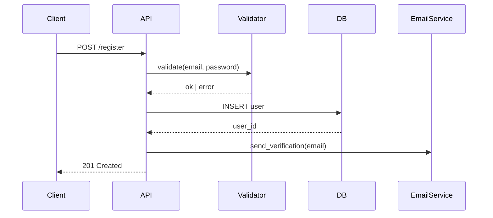

# Lab 4: Agentic Feature Development

**Duration:** ~60 minutes
**Goal:** Build a complete feature end-to-end using agentic workflows — from specification to tested, working code. This is where everything from Labs 1-3 comes together.

---

## The Agentic Development Loop

When building features with agent mode, follow this cycle:

```
Specify → Generate → Review → Test → Iterate → Ship
```

Each step involves Copilot, but **you** drive the direction. The agent generates; you evaluate and steer.

---

## Exercise 1: Spec-Driven Development

Instead of jumping straight to code, start with a specification. This dramatically improves agent output.

### Step 1: Write a feature spec

Create `playground/specs/notification-service.md`:

```markdown
# Feature: Notification Service

## Purpose
A service that sends notifications to users via different channels (email, in-app).
Used by other services to notify users about events (order updates, system alerts, etc.).

## Requirements

### Core
- Accept notification requests with: recipient, channel (email/in-app), subject, body, priority (low/normal/high)
- Validate all input before processing
- Store notifications in memory (no database)
- Return the notification with a generated ID and timestamp

### API
- POST /notifications — create and send a notification
- GET /notifications — list all notifications (with optional filters: channel, priority)
- GET /notifications/:id — get a single notification by ID

### Business Rules
- High-priority notifications are processed immediately
- Email notifications require a valid email address for the recipient
- In-app notifications require a user ID for the recipient
- Notifications have statuses: pending → sent → delivered (or failed)

### Out of Scope
- Actual email sending (mock it)
- Authentication
- Persistence beyond in-memory storage
```

### Step 2: Feed the spec to agent mode

In Copilot Chat (Agent mode):

```
Read the spec at #file:playground/specs/notification-service.md and implement it.

Use [your language/framework]. Follow the project instructions.

Start with the data model, then the service layer, then the API layer.
Create each file separately so I can review as we go.
```

### Step 3: Review at each stage

The agent should create files one at a time (or in logical groups). For each:

1. **Read the generated code** — does it match the spec?
2. **Check for completeness** — are all requirements covered?
3. **Look for issues** — missing validation, wrong status codes, silent failures?
4. **Redirect if needed** — "The priority validation is missing. Add it before moving on."

> **Key Practice:** Do not let the agent generate everything at once and review it all at the end. Review as it goes. It's easier to correct course early.

---

## Exercise 2: Test-Driven Development with Copilot

TDD with Copilot follows a modified flow: you describe the test, Copilot writes it, you verify it fails, then you ask Copilot to make it pass.

### Step 1: Start with tests

```
Using the notification service spec at #file:playground/specs/notification-service.md, 
write tests FIRST — before the implementation.

Write tests for:
1. Creating a valid email notification
2. Creating a valid in-app notification
3. Rejecting a notification with missing subject
4. Rejecting an email notification with invalid email
5. Listing notifications filtered by channel
6. Getting a notification by ID
7. Getting a 404 for a non-existent notification ID

Use [your test framework]. Put tests in the appropriate location.
```

### Step 2: Verify tests fail

```
Run the tests. They should all fail since the implementation doesn't exist yet.
Show me the results.
```

If they don't fail (e.g., the agent created stubs), that's a signal to adjust:

```
Remove any implementation stubs. The tests should fail with import errors 
or missing module errors — that tells us they are testing real code paths.
```

### Step 3: Implement to make tests pass

```
Now implement the notification service to make all tests pass. 
Run the tests after each major component is implemented.
```

### Step 4: Check coverage

```
Are there any code paths in the implementation that are NOT covered by tests?
If so, write additional tests for those paths.
```

---

## Exercise 3: Iterative Feature Building

Real development is never single-prompt. This exercise practices the iterative loop.

### Step 1: Start with a simple version

```
Create a simple task queue in playground/task-queue/ that:
- Accepts tasks with a name and priority (1-5)
- Processes tasks in priority order (highest first)
- Returns the next task to process

Just the core data structure and two functions: add_task and get_next_task.
Use [your language].
```

### Step 2: Add complexity incrementally

After reviewing and accepting the initial implementation, layer on features one at a time:

**Round 2:**
```
Add these features to the task queue:
- A status field (pending, processing, completed, failed)
- A function to mark a task as completed or failed
- Tasks that are already processing should not be returned by get_next_task
```

**Round 3:**
```
Add these features:
- Tasks should have a created_at timestamp
- Add a function to list all tasks with optional filtering by status
- Add a function to get queue statistics: total, pending, processing, completed, failed
```

**Round 4:**
```
Add error handling:
- Reject tasks with priority outside 1-5
- Reject attempts to complete a task that is not in "processing" status
- All functions should return meaningful errors, not throw exceptions
```

**Round 5:**
```
Write comprehensive tests for the entire task queue.
Cover every function, every status transition, and every error case.
Run them and make sure they pass.
```

### Why this pattern works

Each round is small enough to:
- Review thoroughly
- Understand completely
- Test independently
- Roll back if needed

This prevents the "giant blob of agent-generated code that nobody understands" problem.

---

## Exercise 4: Working with Existing Code

Agent mode is not just for greenfield. It is equally powerful for modifying existing code.

### Step 1: Create some "legacy" code

Create `playground/legacy/order_processor.py` (or equivalent in your language) with this intentionally messy but functional code:

```python
import json
from datetime import datetime

orders = []

def proc(data):
    o = json.loads(data)
    if o.get("items") and len(o["items"]) > 0:
        total = 0
        for i in o["items"]:
            if i.get("qty") and i.get("price"):
                total = total + (i["qty"] * i["price"])
                if i["qty"] > 100:
                    total = total * 0.9  # bulk discount
        tax = total * 0.25
        grand = total + tax
        order = {
            "id": len(orders) + 1,
            "date": str(datetime.now()),
            "items": o["items"],
            "subtotal": total,
            "tax": tax,
            "total": grand,
            "status": "new"
        }
        orders.append(order)
        return json.dumps(order)
    return json.dumps({"error": "bad order"})

def get_orders():
    return json.dumps(orders)

def find(id):
    for o in orders:
        if o["id"] == id:
            return json.dumps(o)
    return json.dumps({"error": "not found"})
```

### Step 2: Use agent mode to modernize

```
Refactor #file:playground/legacy/order_processor.py with these goals:
1. Rename functions and variables to be descriptive
2. Extract the discount logic into a separate, testable function
3. Add proper input validation with clear error messages
4. Use proper data classes/models instead of raw dicts
5. Add type hints / proper typing
6. Keep all existing functionality working

Do not change the external behavior — just improve the internal quality.
After refactoring, write tests that verify all the original functionality still works.
```

### Step 3: Review the refactoring

This is where your judgment matters most:

- Did the refactoring preserve behavior?
- Are the new names actually better?
- Is the code easier to understand now?
- Do the tests actually cover the important paths?

If something is off:

```
The discount logic should be a pure function that takes a quantity and price 
and returns the discounted amount. It should not know about orders.
```

---

## Exercise 6: Requirements & Refinement (Before Code)

Agentic workflows are not just for code generation. Some of the highest-leverage uses are *upstream* of code — sharpening fuzzy requirements into something testable.

### Refining a fuzzy requirement

```
This is a draft requirement: "Users should be able to manage their notifications."

Rewrite it as a set of testable user stories with acceptance criteria.
Flag every ambiguity as an open question. Do NOT invent answers — list the questions.
```

### Story splitting

```
This story is too big: [paste].
Split it into 3–5 vertical slices, each independently shippable.
For each slice, list: scope, what's deliberately out of scope, smallest demo.
```

### "What am I missing?" review

```
Here is the spec: #file:playground/specs/notification-service.md

Act as a senior engineer reviewing this spec. Identify:
1. Missing non-functional requirements (perf, security, observability)
2. Implicit assumptions that should be explicit
3. Edge cases the author hasn't considered
4. Dependencies on other systems that aren't called out
5. Anything that will bite us in production

Be ruthless. Don't be polite.
```

### Traceability

```
For each acceptance criterion in #file:playground/specs/notification-service.md,
list the corresponding test in #file:playground/tests/.
Identify any criterion without a test, and any test without a criterion.
```

### Why this matters

Half of "bad AI code" is actually *correct code for a bad spec*. Time spent refining requirements with the agent compounds — every subsequent generation is sharper.

---

## Exercise 7: Architecture & Diagrams from Specs

For architecture work, Copilot is genuinely good at diagram generation. The pattern: spec → diagram → review → iterate. Source files (not images) go into Git.

### Mermaid (renders inline in VS Code, GitHub, Markdown)

```
Generate a Mermaid sequence diagram for the user registration flow in #file:playground/registration.py.
Show: client, API, validation layer, database, email service. Include error paths.
```

Expected output:



### PlantUML

```
Generate PlantUML for the deployment topology described in #file:playground/specs/notification-service.md.
Show all components, their network boundaries, and the protocols between them.
```

Pair with the **PlantUML** VS Code extension to preview live.

### SysML v2

For systems engineers — Copilot can scaffold blocks, parts, and requirement traces:

```
Generate a SysML v2 model for the notification service. Define:
- A 'NotificationRequest' part with attributes recipient, channel, priority
- A 'NotificationService' block with required interfaces
- Requirement IDs that trace to the spec at #file:playground/specs/notification-service.md
```

Tip: provide the agent with one good example of your team's SysML style first, then ask it to match.

### Workflow that works

1. Write a short text spec
2. Ask the agent to produce both the diagram *and* a 5-bullet design summary
3. Review the diagram
4. Iterate: *"Add the retry path. Show timeout as a self-loop on the API."*
5. Commit the source (`.mmd`, `.puml`, `.sysml`) — never just the rendered image

---

## Exercise 8: Your Own Feature

Now apply everything to a feature you would actually build at work.

### Choose a small feature from your real backlog:

Examples:
- A configuration parser that reads from environment variables with defaults and validation
- A retry mechanism with exponential backoff for HTTP calls
- A data transformation pipeline that converts between two formats
- A simple caching wrapper with TTL expiration
- A logging decorator/middleware that standardizes request logging

### Build it end-to-end:

1. **Write a short spec** in `playground/specs/` (10-15 lines — purpose, requirements, constraints)
2. **Generate with agent mode** using the spec as context
3. **Review and iterate** — redirect at least twice
4. **Write tests** — either TDD or after implementation
5. **Run everything** — make sure it works

### Reflect:

- How long would this take without Copilot?
- How much of the agent output did you accept as-is vs. modify?
- What instructions would you add to `copilot-instructions.md` based on this experience?

---

## Common Pitfalls in Agentic Development

| Pitfall | What happens | How to avoid it |
|---------|-------------|----------------|
| "Generate everything" | Huge diff you can't review | Build incrementally, review each step |
| No spec | Agent guesses your requirements | Write a short spec first, even 5 lines |
| Accepting without reading | Bugs and patterns you don't understand | Review every diff like a pull request |
| Never iterating | Mediocre first-draft code ships | Always do at least one refinement pass |
| Skipping tests | No confidence in correctness | Tests are not optional — they are the verification step |
| Over-prompting | Too many requirements in one prompt | Split into focused, sequential prompts |

---

## Discussion Points

1. **How does spec-first development change** the way you use Copilot?
2. **Where is the line between iterating with the agent** and just writing the code yourself?
3. **How would you integrate agentic workflows** into your team's PR process?
4. **What types of features** are best suited for agent mode vs. traditional development?

---

## Key Takeaways

- **Start with a spec** — even a short one dramatically improves agent output
- **Build incrementally** — small steps with review, not one giant generation
- **TDD works great** with agent mode — describe the tests, let the agent write them, then implement
- **Working with existing code** is a strength — agent mode excels at refactoring, modernizing, and extending
- **Your judgment is the quality gate** — agent mode is the accelerator, you are the quality control
- **Everything from Labs 1-3 compounds here** — instructions, prompt files, and agent skills all contribute
- **Refine requirements first** — half of "bad AI code" is correct code for a bad spec
- **Diagrams from specs** — Mermaid / PlantUML / SysML all work; commit the source, not the rendered image

---

**Next:** [Lab 5: Quality Guardrails →](05-quality-and-review.md)
